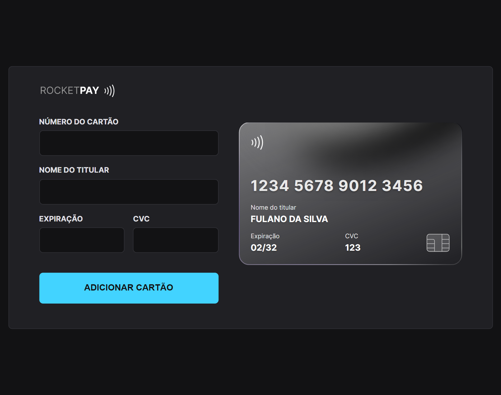

# Rocketpay

## Projeto 💻
Projeto desenvolvido durante o Explorer Lab da Rocketseat.  
(https://www.figma.com/file/LEz0vMI0czjTAaT7gYwpk7/Explorer-Lab-%2301-(Copy))

## Instalação 🛠
Siga esses passos para instalar o repositório na sua máquina:
1. Rode `git clone https://github.com/miishiyama/Rocketpay` para fazer um clone desse repositório.
2. Rode `npm i` para instalar as dependências do projeto.
3. Rode `npm run dev` para iniciar o servidor de desenvolvimento.
4. Entre no link que aparecer no terminal.

## Tecnologias 🚀
As tecnologias utilizadas neste projeto são:
- HTML
- CSS
- Node
- NPM
- Vite
- IMask
- JavaScript
- DOM
- Media Queries

## Créditos ❤️
Feito por [Millene Eduarda Ishiyama](https://github.com/miishiyama/).
